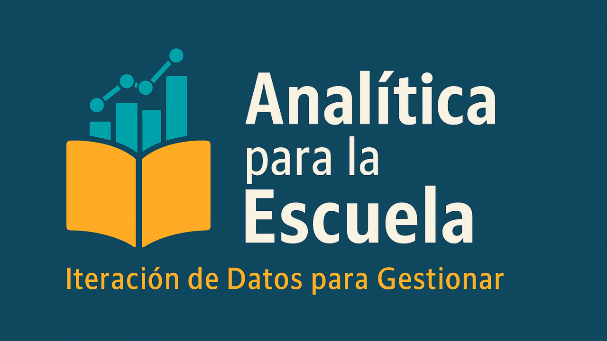
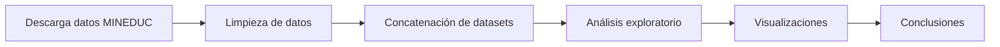

# 📊 Calificaciones en Tiempo de COVID-19

**Análisis del impacto de la pandemia en las notas de enseñanza media en Chile (2018-2021)**


---

## 🎯 Pregunta de investigación

**¿Cómo afectó la pandemia por COVID-19 las calificaciones de estudiantes de IV Medio en Chile?**

Durante 2020 y 2021, los establecimientos educacionales debieron adaptarse a modalidades de educación a distancia, híbrida y presencial con restricciones. Los docentes evaluaron a través de diversos medios (videos, formularios Google, trabajos escritos por email, guías en papel), pero ¿esto impactó las notas finales?

### 🔍 Contexto del problema

- **2020**: Año de pandemia con educación 100% remota
- **2021**: Año de retorno gradual (híbrido/presencial con restricciones)
- **Presión adicional**: NEM y Ranking como factores de admisión universitaria
- **Decreto 67**: Nueva normativa de evaluación vigente desde 2020
- **Incógnita**: ¿Las notas reflejan aprendizajes reales o son producto del contexto excepcional?

---

## 📈 Principales hallazgos

### 🔴 Impacto del 2020

> **Las notas de IV Medio subieron 0.7 décimas a nivel nacional en 2020 comparado con 2018-2019**

- 📊 **9 de 16 regiones** estuvieron igual o sobre la media nacional en 2020
- 📉 Menos regiones sobre la media que en 2018 (10 regiones)
- 🔄 Similar cantidad que en 2019 (9 regiones)

### 🟠 Comportamiento en 2021

- Las notas disminuyeron respecto a 2020, pero **se mantuvieron más altas que en 2018-2019**
- Explicación probable: muchos colegios mantuvieron sistema virtual o híbrido parte del año
- El tipo de evaluación (remota/híbrida) impactó las calificaciones otorgadas

### 🟡 Proyección

Si se considera:
- Presión del **NEM** (Notas de Enseñanza Media)
- Impacto del **Ranking** de notas
- Efectos del **Decreto 67** de evaluación

➡️ **Proyección**: Las notas se mantendrán sobre 6.0 y posiblemente sigan aumentando

### ⚠️ Pregunta crítica

**¿Hasta qué punto el aumento de calificaciones refleja logros de aprendizaje reales vs. mera certificación de actividades realizadas?**

---

## 📊 Alcance del análisis

### Período de estudio

| Año | Contexto educativo | Rol en el análisis |
|-----|-------------------|-------------------|
| **2018** | Pre-pandemia | Línea base (nueva región Ñuble) |
| **2019** | Pre-pandemia | Referencia normal |
| **2020** | Pandemia (remoto) | Año de impacto principal |
| **2021** | Post-pandemia (híbrido) | Año de transición |

### Población estudiada

- **Nivel**: IV Medio (último año de enseñanza media)
- **Modalidad**: Establecimientos Científico-Humanistas
- **Justificación**: Enfoque prioritario en continuación de estudios superiores
- **Alcance**: Nacional con desagregación regional

### Datos utilizados

**Fuente oficial**: Base de datos MINEDUC "Notas y egresados de enseñanza media"

| Año | Estudiantes declarados | Egresados reportados | Observaciones |
|-----|----------------------|---------------------|---------------|
| 2018 | ~978,137 | ~240,000 | Año base |
| 2019 | ~978,137 | ~240,000 | Pre-pandemia |
| 2020 | 978,137 | ~240,000 | Pandemia |
| 2021 | 330,005 | 280,013 | ⚠️ Anomalía en datos* |

*⚠️ **Nota importante**: El dataset 2021 declara solo 330,005 estudiantes pero reporta ~280,013 egresados (~40,000 más que años anteriores). No hay explicación oficial del MINEDUC sobre esta discrepancia.

---

## 🛠️ Metodología

### Proceso de análisis



### 1. Obtención de datos

Datos descargados de: https://datosabiertos.mineduc.cl/notas-y-egresados-de-ensenanza-media/

Archivos incluyen:
- Base de datos por año (2018, 2019, 2020, 2021)
- Diccionarios de variables
- Metadatos de establecimientos

### 2. Limpieza de datos

```python
# Proceso aplicado a cada dataset:
1. Identificación y manejo de valores NaN
2. Eliminación de filas con datos faltantes críticos
3. Conversión de tipos de datos (object → float)
4. Estandarización de nombres de columnas
5. Filtrado por modalidad (Científico-Humanista)
6. Filtrado por nivel (IV Medio)
```

### 3. Concatenación

- Unión de los 4 datasets anuales
- Creación de variable temporal para análisis longitudinal
- Validación de consistencia entre años

### 4. Análisis y visualización

**Librerías utilizadas:**
- `pandas` - Manipulación de datos
- `numpy` - Operaciones numéricas
- `matplotlib` - Visualizaciones base
- `seaborn` - Visualizaciones estadísticas avanzadas

**Métricas calculadas:**
- Promedio general por región y año
- Mediana de notas
- Distribución de calificaciones
- Comparaciones interanuales

---

## 📁 Estructura del proyecto

```
calificaciones-covid/
│
├── notebooks/
│   ├── rendimiento_2022.ipynb              # Análisis año 2022
│   ├── rendimiento_2002_-2022.ipynb        # Análisis longitudinal 20 años
│   └── Notas_Cuarto_Medio_CH_IV_medio_2018_-_2021.ipynb  # Análisis principal
│
├── data/                                    # ⚠️ NO incluido en repo
│   ├── rendimiento_2018.csv               # Descargar de MINEDUC
│   ├── rendimiento_2019.csv
│   ├── rendimiento_2020.csv
│   ├── rendimiento_2021.csv
│   └── diccionarios/
│
├── outputs/                                # Gráficos generados
│   └── visualizaciones/
│
├── README.md                               # Este archivo
└── requirements.txt                        # Dependencias
```

---

## 🚀 Cómo usar este proyecto

### Requisitos previos

```bash
Python 3.8+
Jupyter Notebook o JupyterLab
```

### Instalación

```bash
# Clonar el repositorio
git clone https://github.com/[tu-usuario]/calificaciones-covid.git
cd calificaciones-covid

# Crear entorno virtual (recomendado)
python -m venv venv
source venv/bin/activate  # En Windows: venv\Scripts\activate

# Instalar dependencias
pip install -r requirements.txt
```

### Obtener los datos

**⚠️ IMPORTANTE**: Los archivos de datos son muy pesados (>100MB) y NO están incluidos en el repositorio.

**Pasos para obtener los datos:**

1. Visita: https://datosabiertos.mineduc.cl/notas-y-egresados-de-ensenanza-media/

2. Descarga los siguientes archivos:
   - `Rendimiento por estudiante 2018`
   - `Rendimiento por estudiante 2019`
   - `Rendimiento por estudiante 2020`
   - `Rendimiento por estudiante 2021`

3. Colócalos en la carpeta `data/`:
   ```
   calificaciones-covid/
   └── data/
       ├── rendimiento_2018.csv
       ├── rendimiento_2019.csv
       ├── rendimiento_2020.csv
       └── rendimiento_2021.csv
   ```

### Ejecutar el análisis

```bash
# Iniciar Jupyter
jupyter notebook

# Abrir el notebook principal:
# notebooks/Notas_Cuarto_Medio_CH_IV_medio_2018_-_2021.ipynb

# Ejecutar las celdas secuencialmente
```

---

## 📊 Ejemplos de visualizaciones

El proyecto genera visualizaciones de:

### Distribución de notas por región y año

- Box plots comparativos
- Series de tiempo
- Mapas de calor regionales

### Comparaciones interanuales

- Evolución 2018 → 2021
- Diferencias 2020 vs años normales
- Análisis de dispersión

### Análisis estadístico

- Medianas por región
- Percentiles
- Distribuciones de frecuencia

---

## 🔍 Consideraciones metodológicas

### Limitaciones del estudio

1. **Datos 2021**: Anomalía no explicada en cantidad de estudiantes declarados
2. **Causalidad**: Correlación no implica causalidad (múltiples factores influyeron)
3. **Alcance**: Solo establecimientos Científico-Humanistas
4. **Variables no consideradas**: 
   - Nivel socioeconómico
   - Tipo de dependencia (municipal, particular subvencionado, particular pagado)
   - Acceso a tecnología durante pandemia
   - Modalidad específica de evaluación por establecimiento

### Supuestos

- Se asume que los datos reportados por establecimientos son precisos
- Se considera que la metodología de evaluación cambió de forma similar en todos los establecimientos durante 2020
- Se presume que las notas son comparables entre años (misma escala 1-7)

---

## 💡 Implicaciones

### Para política educativa

- 📌 Necesidad de evaluar si el aumento de notas refleja aprendizaje real
- 📌 Considerar ajustes en NEM y Ranking para contexto pandemia
- 📌 Revisar efectos del Decreto 67 en la evaluación

### Para establecimientos educacionales

- 📌 Reflexionar sobre prácticas de evaluación remota/híbrida
- 📌 Equilibrio entre evaluación formativa y calificación
- 📌 Consideración del contexto excepcional al calificar

### Para investigación

- 📌 Análisis longitudinal del impacto post-pandemia
- 📌 Estudios cualitativos sobre aprendizajes reales vs notas
- 📌 Comparación con rendimiento en pruebas estandarizadas (PAES/PDT)

---

## 📚 Contexto normativo

### Decreto 67 (2018)

Marco regulatorio de evaluación que entró en vigencia oficialmente en 2020:

- Enfoque en evaluación formativa
- Mayor autonomía evaluativa para docentes
- Flexibilidad en criterios de promoción
- Coincidió temporalmente con la pandemia

### Sistema de admisión universitaria

Factores que influyen en las presiones sobre calificaciones:

- **NEM (Notas de Enseñanza Media)**: 30% del puntaje de admisión
- **Ranking**: Posición relativa en el establecimiento (30%)
- **PAES** (ex PSU/PDT): 40% del puntaje

---

## 🔮 Trabajo futuro

### Análisis pendientes

- [ ] Incorporar datos 2022 (cuando estén disponibles)
- [ ] Análisis por dependencia administrativa
- [ ] Correlación con resultados PAES/PDT
- [ ] Análisis de brechas socioeconómicas durante pandemia
- [ ] Comparación con otros países de la región
- [ ] Análisis cualitativo de prácticas de evaluación

### Extensiones posibles

- [ ] Dashboard interactivo con Plotly/Dash
- [ ] Análisis predictivo de tendencias post-pandemia
- [ ] Estudio de retención y deserción escolar
- [ ] Análisis de asistencia durante pandemia

---

## 🤝 Contribuciones

Este proyecto es de investigación educativa y las contribuciones son bienvenidas:

- 🐛 Reportar errores en análisis
- 💡 Sugerir nuevas visualizaciones
- 📊 Compartir análisis complementarios
- 📝 Mejorar documentación

---

## 📖 Referencias

### Fuentes de datos

- **MINEDUC - Datos Abiertos**: https://datosabiertos.mineduc.cl/
- **Centro de Estudios MINEDUC**: https://centroestudios.mineduc.cl/

### Marco normativo

- **Decreto 67/2018**: Normas mínimas sobre evaluación y promoción
- **Ley 21.091**: Sistema de Educación Superior

### Contexto pandemia

- **UNESCO**: Respuestas educativas a COVID-19 en América Latina
- **CEPAL-UNESCO**: La educación en tiempos de la pandemia de COVID-19

---

## 👤 Autor

**Claudio Rojas Monsalves**

*Director Académico y Analista de Datos Educativos*

Este análisis surge de la necesidad de comprender, con datos, el impacto real de la pandemia en la educación chilena, más allá de percepciones anecdóticas.

- 📧 crojasmon@gmail.com
- 💼 [LinkedIn](https://www.linkedin.com/in/claudio-rojas-monsalves)
- 🐙 [GitHub](https://github.com/ClaudioRojasMon)

---

## 📜 Licencia

Este proyecto está bajo licencia MIT - ver el archivo LICENSE para detalles.

Los datos utilizados son de dominio público y están disponibles en el portal de Datos Abiertos del MINEDUC.

---

## 🔗 Proyectos relacionados

Si te interesó este proyecto, también revisa:

- [📊 Trayectorias_Academicas](https://github.com/ClaudioRojasMon/Trayectorias_Academicas) - Análisis longitudinal de rendimiento estudiantil
- [📊 paes-ranking-chile](https://github.com/ClaudioRojasMon/paes-ranking-chile) - Ranking de resultados PAES por establecimiento
- [📖 analizador-lexile-chile](https://github.com/ClaudioRojasMon/analizador-lexile-chile) - Análisis de complejidad lectora
- [📚 Apoyo](https://github.com/ClaudioRojasMon/Apoyo) - Jupyter Book de Python para educación media

---

## ⭐ Si este proyecto te fue útil

- Dale una estrella ⭐ al repositorio
- Compártelo con otros educadores o investigadores
- Cítalo en tus trabajos académicos
- Contribuye con análisis o sugerencias

---

## 📝 Cómo citar este proyecto

```bibtex
@misc{rojas2023calificaciones_covid,
  author = {Rojas Monsalves, Claudio},
  title = {Calificaciones en Tiempo de COVID-19: Análisis del impacto de la pandemia en las notas de enseñanza media en Chile},
  year = {2023},
  publisher = {GitHub},
  url = {https://github.com/ClaudioRojasMon/calificaciones-covid}
}
```

---

💙 Desarrollado con pasión por la educación desde el sur de Chile 🇨🇱
